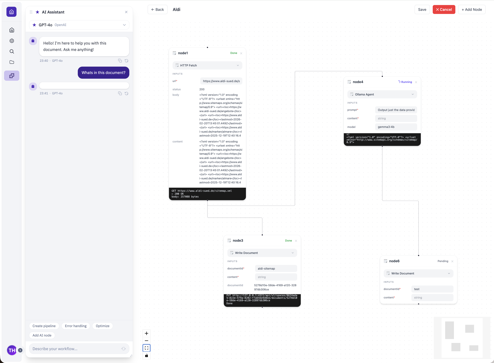

This is a proof-of-concept enterprise grade project documentation tool based on text documents, with minimal dependencies.

Supports multiple spaces, space personalization, and real-time collaboration within the powerful and customizable tiptap editor. Authenticate over generic OAuth2 or implement your own authentication system with better-auth.

## Features

- Space Extensions for custom functionality and interfaces
- REST API
- Webhooks
- SSO with groups
- Real-time collaborative multiplayer
- Modern Editing Experience
- Multiple isolated spaces
- Access-Control
- Organisiation using cateogries and document hirachy
- Detailed version history
- Basic Table formulas
- Imports of various formats with pandoc
- Mentions
- Full-text search
- Single Service

<!-- What -->

<!--### What

- Content as text
- Revisions
- Access Control
- Workflows-->

<!-- Why -->

<!--### Why

I felt like there was a need for a data oriented documentation and automation system.-->

<!-- How -->
