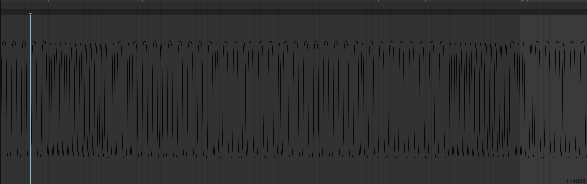
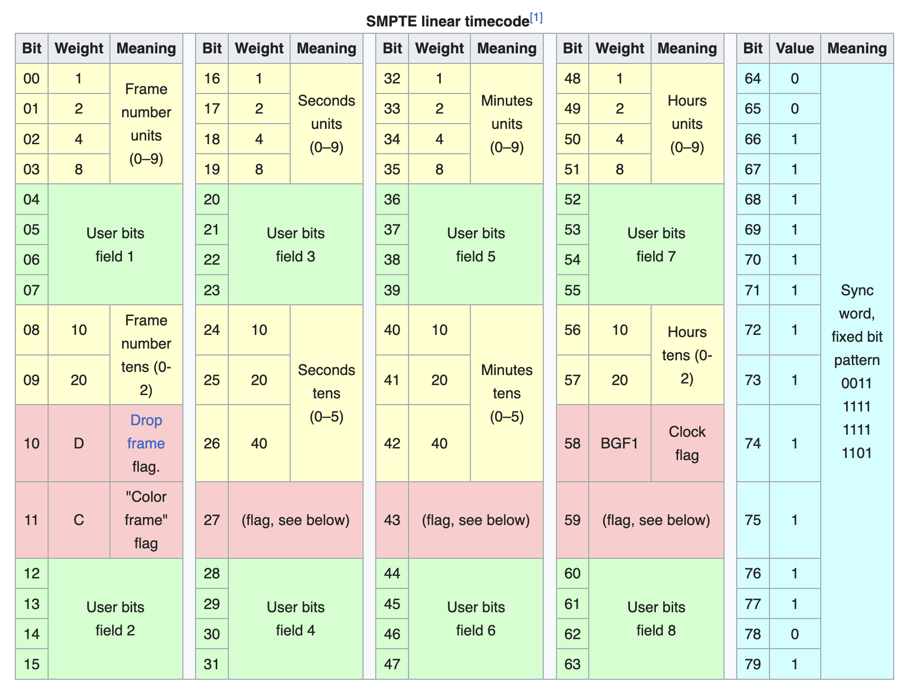

This won't be a tutorial, just a quick overview about Linear Timecode and how I implemented it in Javascript.
For a working example, you can take a look at my original code here:
https://github.com/luckydye/linear-timecode

## What is Linear Timecode?

Linear Timecode (LTC) it a variant of SMPTE timecode.
It is a way to encode time into an audio signal. It is used in the film and music industry to synchronize audio and video.

It carries information about the framerate and current time in a hour:minute:second:frame format.

I used [this](https://elteesee.pehrhovey.net/) wonderful website to generate a LTC audio file for this example.

## Convert audio to binary.



The above image is the waveform of our LTC audio file.
It has a sample rate of 44.1kHz (1000 x 44.1 cycles per second).
Each sample contains 24 bits, and we send 44100 samples every second.

We can use the Web Audio API to read the audio signal from the file. Or in this case, from some audio input.

```typescript
async function getMedia() {
  let stream: MediaStream | undefined;

  try {
    stream = await navigator.mediaDevices.getUserMedia({
      audio: {
        // We disable all audio processing, so we get as clean of a signal as possible.
        autoGainControl: false,
        echoCancellation: false,
        noiseSuppression: false,
      },
    });
  } catch (err) {
    console.error(err);
  }

  return stream;
}
```

Now we can _listen_ to that audio stream. Though we don't actually want to output the audio, we just need to process the signal.

The Web Audio API has a feature called AudioWorklets, which allows us to run custom code on the audio signal.

```typescript
class LTC extends AudioWorkletProcessor {
  process(inputs, outputs, parameters) {
    const samples = inputs[0][0];
    // do stuff with the samples
    return true;
  }
}

// register our custom AudioWorklet as "ltc".
registerProcessor("ltc", LTC);
```

Then we connect the audio stream to a new instance of our LTC AudioWorklet.

```typescript
const audioCtx = new AudioContext();
const source = audioCtx.createMediaStreamSource(stream);
const processor = new AudioWorkletNode(audioCtx, "ltc");
source.connect(processor);
```

<br/>

But there is still a problem, we can't read time from this signal yet. We have a waveform, an array of numbers between -1 and 1, but we want a binary format, ones and zeros. The data we are looking for is encoded in the _Differential Manchester encoding (DM)_ format.
It encodes 1s and 0s in the polarity transitions of the audio signal. 0 is represented by a transition and 1 is represented by no transition.

Getting this right was the most difficult part of this project.

```typescript
const SYNC_WORD = [0, 0, 1, 1, 1, 1, 1, 1, 1, 1, 1, 1, 1, 1, 0, 1];

class LTC extends AudioWorkletProcessor {
  buffer = [];
  sign = 0;
  transitions = 0;
  sampleCount = 0;

  process(inputs, outputs, parameters) {
    const samples = inputs[0][0];

    if (samples) {
      for (let i = 0; i < samples.length; i++) {
        if (samples[i] === 0) continue;

        this.sampleCount++;

        // get polarity of current sample
        const currSign = Math.sign(samples[i]);

        if (this.sign !== currSign) {
          this.transitions++;
          this.sign = currSign;

          const periodLength = (globalThis.sampleRate / 48000) * 16;
          if (this.sampleCount >= periodLength) {
            // eval transition count, should be either 1 or 2
            if (this.transitions === 1) {
              this.buffer.push(0);
            } else if (this.transitions === 2) {
              this.buffer.push(1);
            } else {
              // clear buffer on invalid input
              this.buffer.length = 0;
            }
            this.transitions = 0;
            this.sampleCount = 0;
          }
        }
      }
    }

    // find next sync word
    const bitString = buffer.join("");
    const syncIndex = bitString.indexOf(SYNC_WORD.join("")); // I know this is not the most efficient way to do this.
    if (syncIndex !== -1) {
      buffer.splice(0, syncIndex);

      // splice ltc buffer and parse
      if (buffer.length > 80 * 2) {
        const tc = parseLTCChunk(buffer.splice(0, 80));
        // send timecode to main thread
        this.port.postMessage(tc);
      }
    }

    return true;
  }
}
```

<br/>

After getting the binary data out of the signal, we need to look for the sync word, a sequence of 1s and 0s, 0011111111111101.
The image below shows the layout of a single LTC frame. The sync word, comes between every frame, so we can also use it to find the start of a frame.


Source: https://en.wikipedia.org/wiki/Linear_timecode#cite_note-BR.780-2-1

## Decoding the binary data.

Decoding the binary data is pretty straight forward. We just need to read the bits in the correct order and convert them to decimal.

```typescript
function parseLTCInt(arr) {
  return parseInt(arr.reverse().join(""), 2);
}

function parseLTCChunk(chunk) {
  const syncWord = chunk.splice(0, 16);

  const frame = chunk.splice(0, 16);
  const seconds = chunk.splice(0, 16);
  const minutes = chunk.splice(0, 16);
  const hours = chunk.splice(0, 16);

  const frameNumberUnits = parseLTCInt(frame.slice(0, 4));
  const frameNumberTens = parseLTCInt(frame.slice(8, 8 + 2));

  const secondsUnits = parseLTCInt(seconds.slice(0, 4));
  const secondsTens = parseLTCInt(seconds.slice(8, 8 + 3));

  const minutesUnits = parseLTCInt(minutes.slice(0, 4));
  const minutesTens = parseLTCInt(minutes.slice(8, 8 + 3));

  const hoursUnits = parseLTCInt(hours.slice(0, 4));
  const hoursTens = parseLTCInt(hours.slice(8, 8 + 2));

  const timecode = {
    hours: +(hoursTens + "" + hoursUnits),
    minutes: +(minutesTens + "" + minutesUnits),
    seconds: +(secondsTens + "" + secondsUnits),
    frame: +(frameNumberTens + "" + frameNumberUnits),
    dropFrame: frame.slice(10, 11)[0],
    colorFrame: frame.slice(11, 12)[0],
    clock: hours.slice(10, 11)[0],
    userBits1: frame.slice(4, 4 + 4),
    userBits2: frame.slice(12, 12 + 4),
    userBits3: seconds.slice(12, 12 + 4),
    userBits4: seconds.slice(12, 12 + 4),
    userBits5: minutes.slice(12, 12 + 4),
    userBits6: minutes.slice(12, 12 + 4),
    userBits7: hours.slice(12, 12 + 4),
    userBits8: hours.slice(12, 12 + 4),
  };

  return timecode;
}
```

Now we receive a timecode object about every 33ms, or 30 times a second, from the AudioWorklet and we can render it to the page.

<video width="100%" muted autoplay loop>
  <source src="/media/ltc-timecode_s.mp4" type="video/mp4">
</video>

<br/>

This could sync music or visuals on any device with just an audio cable, or even a wireless connection.
(I may cover streaming a raw audio signal with a peer-to-peer connection in another post.)

For some reason audio stuff excites me, it is such a basic format, but you can do so many different things with it.

## Conclusion

This was a fun project, and I learned a lot about audio signals and the Web Audio API.
I hope you enjoyed reading this article, and maybe learned something new.
